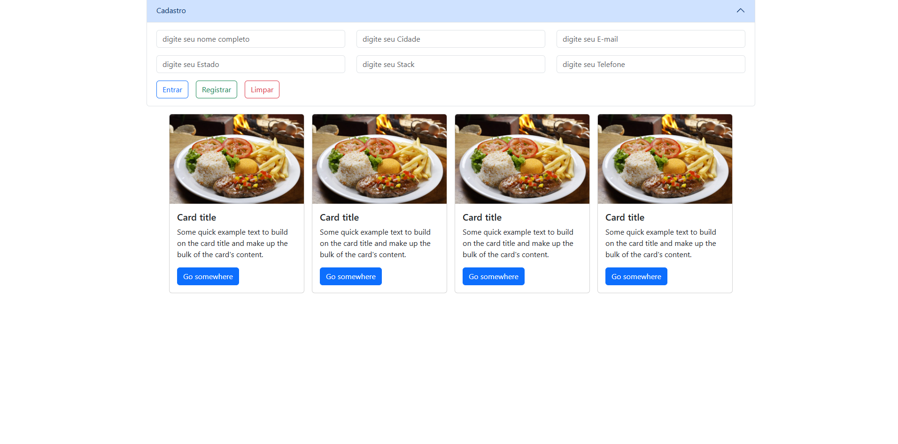

#### Revisão Angular com a versão 16



#### Portas dos frameworks mais communs
* angualr 4200
* next    3000
* react   5173
* vue     4200

#### criando o projeto angular
 
```
npx @angular/cli@16 new app01
```

* 2. entrar na pasta do projeto
```  
cd app01
```

* 3. rodar o projeto
```
npm start 
```

* primeiros condigos de html
    * app.component.html
    
    * app.component.scss

#### Diretivas angular components
    * npx ng g c cadastro 

#### Estilização
* scss *

* boostrap 3 versão atual 5
    * <link rel="stylesheet" href="https://cdnjs.cloudflare.com/ajax/libs/bootstrap/5.3.2/css/bootstrap.min.css" />
* tailwind css 3 ou 4
    * <script src="https://cdn.tailwindcss.com"></script>
* material designer
    * https://v16.material.angular.io/
* scass